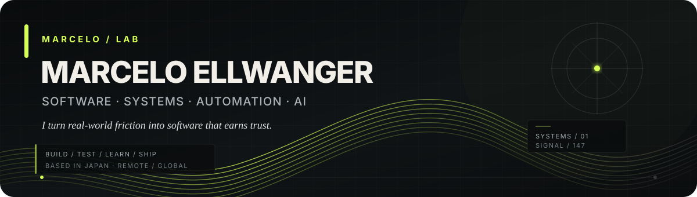
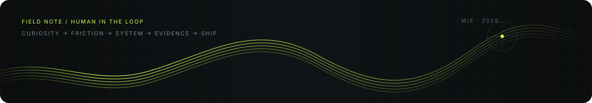

  

  <a href="https://marcelosofficial-ctrl.github.io/portfolio/"><b>Portfolio</b></a>
  &nbsp;·&nbsp;
  <a href="https://www.linkedin.com/in/marcelo-ellwanger-10657a435/"><b>LinkedIn</b></a>
  &nbsp;·&nbsp;
  <a href="https://marcelosofficial-ctrl.github.io/portfolio/resume/software/"><b>Software / QA Résumé</b></a>
  &nbsp;·&nbsp;
  <a href="https://marcelosofficial-ctrl.github.io/portfolio/resume/Marcelo_Ellwanger_Software_QA_Resume.pdf"><b>Résumé PDF</b></a>

  
  
  
  
  

## About

I build practical software around problems I actually encounter: Windows diagnostics, local AI tooling, automation, computer vision and evidence-driven data systems.

My route into software came through hands-on electrical troubleshooting, operations and customer-facing work across several countries. That background is why I care about **reliability, clear failure modes, measurable performance and software that behaves well outside a demo**.

> **Current goal:** software engineering, QA / automation and technical systems roles where debugging, reliability and fast learning matter.

  

> *Most of these projects began the same way: I got curious, then annoyed that the tool I wanted did not exist.*

## At a glance

<table>
<tr>
<td width="25%" valign="top">
<b>SHIPPED</b> 
<strong>VektorDeck 1.0</strong> 
Local AI workstation manager
</td>
<td width="25%" valign="top">
<b>FIELD TESTED</b> 
<strong>Retro Game Vision</strong> 
Vision + evidence-driven resale system
</td>
<td width="25%" valign="top">
<b>V0.1 BETA READY</b> 
<strong>CrashScope</strong> 
Windows crash diagnostics
</td>
<td width="25%" valign="top">
<b>ACTIVE</b> 
<strong>EasyFLix / ReelShelf</strong> 
Non-destructive local media library
</td>
</tr>
</table>

## Selected engineering work

<table>
<tr>
<td width="50%" valign="top">

### VektorDeck 1.0 · released

Local-first Windows workstation manager for GGUF model intelligence, safe runtime ownership, hardware telemetry, evidence-aware benchmarking and explainable launch recommendations.

**Python · FastAPI · React · TypeScript · SQLite**

Built from a real local-AI setup that had become too dependent on exact flags, scattered model files and terminal workflows.

[**Case study →**](https://marcelosofficial-ctrl.github.io/portfolio/projects/vektordeck/) · [**Repository →**](https://github.com/marcelosofficial-ctrl/VektorDeck)

</td>
<td width="50%" valign="top">

### Retro Game Vision · field tested

A provenance-first computer-vision and resale-decision pipeline that preserves exact physical-copy evidence, compatibility, uncertainty and reproducible economics.

**Python · SQLite · Computer Vision · Data Engineering**

Private field validation has reached **750+ canonical items, 1,000+ physical observations and 1,800+ market observations**. The public repo is a portfolio-safe runnable implementation.

[**Case study →**](https://marcelosofficial-ctrl.github.io/portfolio/projects/reseller-ai/) · [**Repository →**](https://github.com/marcelosofficial-ctrl/Retro-Game-Vision-Pipeline)

</td>
</tr>
<tr>
<td width="50%" valign="top">

### CrashScope · v0.1 beta ready

Local-first Windows crash diagnostics that correlate low-overhead CPU/GPU/RAM telemetry with Event Log, WER, watchdog and workload evidence while keeping observation separate from unsupported causation.

**C# · .NET 10 · React · TypeScript · SQLite**

- 185 automated .NET tests
- **0.2657% average Agent CPU** in the final integrated 30-second validation sample
- **93 MB average / 95.83 MB peak working set** in that same sample
- exact-artifact portable release validation
- localhost-only, no analytics, no automatic upload

[**Case study →**](https://marcelosofficial-ctrl.github.io/portfolio/projects/crashscope/)

</td>
<td width="50%" valign="top">

### EasyFLix · active build

**Current pre-1.0 working title: ReelShelf. Planned release name: EasyFLix.**

A non-destructive Windows media-library application for legally acquired local movie, TV and anime files across multiple drives. The application scans configured sources read-only, organizes the library, supports artwork and subtitle workflows, and keeps the original files authoritative.

**WPF · C# · .NET 10 · Windows Desktop**

Current engineering evidence includes **48 automated tests, zero build warnings and a checksum-verified portable 0.6.0 win-x64 artifact**. Subtitle retrieval uses SubDL plus hash/title/episode-verified OpenSubtitles fallback, with provider-specific retry caching to avoid wasting API quota on repeated terminal attempts. The project remains pre-1.0, so the case-study route and working-title compatibility are intentionally preserved until the coordinated EasyFLix release.

[**Active case study →**](https://marcelosofficial-ctrl.github.io/portfolio/projects/reelshelf/)

</td>
</tr>
</table>

### MinimalClock · shipped

A lightweight Rainmeter desktop utility with persistent settings, automated validation, packaging and measured performance rather than an unnecessarily heavy runtime.

**Rainmeter · HTML · CSS · JavaScript · GitHub Actions**

Measured additional Rainmeter-process overhead on the development machine: about **+2.17 MB working set** with seconds hidden.

[**Case study →**](https://marcelosofficial-ctrl.github.io/portfolio/projects/rainmeter-clock/) · [**Repository →**](https://github.com/marcelosofficial-ctrl/MinimalClock)

## Engineering principles

<table>
<tr>
<td><b>01 · Start with reality</b> Prefer real constraints, imperfect inputs and problems that exist outside a demo.</td>
<td><b>02 · Keep the evidence</b> Preserve provenance, uncertainty and the reason a system reached a result.</td>
<td><b>03 · Make failure useful</b> Turn unexpected behavior into tests, safer boundaries and better architecture.</td>
</tr>
</table>

## What I work with

**Languages / frameworks**  
C# · .NET 10 · Python · FastAPI · React · TypeScript · WPF · HTML · CSS · JavaScript

**Data / systems**  
SQLite · REST APIs · Windows diagnostics · local AI / GGUF tooling · computer vision · telemetry

**Engineering**  
Testing · debugging · Git / GitHub · GitHub Actions · CI · performance budgets · evidence lineage · reproducible validation · technical documentation

## Current focus

- Taking **CrashScope** through its first public Windows beta.
- Building **EasyFLix** toward its coordinated 1.0 release.
- Refining practical local-first tools around problems I use myself.
- Strengthening release engineering, testing and systems-design depth.
- Looking for remote-friendly software engineering, QA / automation and technical systems opportunities.

  <b>Based in Japan · Remote / global · Flexible across time zones</b>

