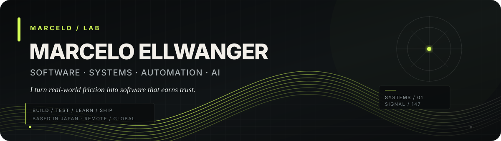
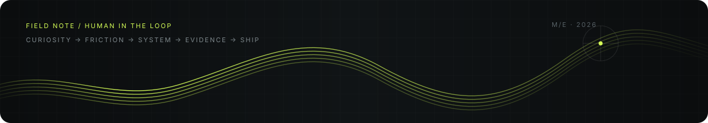

  

  <a href="https://marcelosofficial-ctrl.github.io/portfolio/"><strong>PORTFOLIO</strong></a>
  &nbsp;·&nbsp;
  <a href="https://marcelosofficial-ctrl.github.io/portfolio/resume/software/"><strong>RÉSUMÉ</strong></a>
  &nbsp;·&nbsp;
  <a href="https://www.linkedin.com/in/marcelo-ellwanger-10657a435/"><strong>LINKEDIN</strong></a>

  
  
  
  
  
  

  <strong>MARCELO / LAB</strong> · practical software · evidence-first engineering · systems that survive contact with reality

---

## SIGNAL

I build practical software around problems I actually encounter: Windows diagnostics, local AI tooling, automation, computer vision, media systems and evidence-driven developer tools.

My engineering style comes from hands-on electrical work, operations and customer-facing work across Canada, Australia and Japan. I care about **reliability, measurable behavior, clear failure modes and software that holds up outside a demo.**

  

> *Curiosity becomes a system when the evidence survives the experiment.*

---

## SYSTEM STATUS

<table>
<tr>
<td width="25%" align="center" valign="top">
<strong>ACTIVE / SHIPPED</strong> 
CRASHSCOPE 1.3 / 1.2  
Windows diagnostics 
<strong>266 / 266 tests</strong>
</td>
<td width="25%" align="center" valign="top">
<strong>SHIPPED</strong> 
EASYFLIX 1.4  
Local media systems 
<strong>219 tests · MIT</strong>
</td>
<td width="25%" align="center" valign="top">
<strong>ACTIVE</strong> 
REVDEV  
AI-assisted development 
<strong>Development only</strong>
</td>
<td width="25%" align="center" valign="top">
<strong>FIELD TESTED</strong> 
RETRO GAME VISION  
Vision + provenance 
<strong>Reproducible validation</strong>
</td>
</tr>
</table>

---

## FEATURED BUILDS

<table>
<tr>
<td width="50%" valign="top">

### CRASHSCOPE
**1.2 · Released**

Local-first Windows crash diagnostics for games, hardware testing and GPU-heavy workloads.

**266 / 266 automated .NET tests · 1.2.0 public**

Event Log + WER correlation · persistent incident evidence · privacy-safe support bundles · ConfigTrace integration

[Case study →](https://marcelosofficial-ctrl.github.io/portfolio/projects/crashscope/) · [Repository →](https://github.com/marcelosofficial-ctrl/CrashScope) · [Release →](https://github.com/marcelosofficial-ctrl/CrashScope/releases/tag/v1.2.0)

</td>
<td width="50%" valign="top">

### EASYFLIX
**1.4 · Released · MIT**

Local-media application built around read-only indexing, removable-drive resilience, playback state, Favorites and deterministic media intake.

**219 automated tests · 0 build warnings**

Installer + portable win-x64 artifacts · SHA-256 release checksums

[Case study →](https://marcelosofficial-ctrl.github.io/portfolio/projects/easyflix/) · [Repository →](https://github.com/marcelosofficial-ctrl/EasyFlix) · [Release →](https://github.com/marcelosofficial-ctrl/EasyFlix/releases/tag/v1.4.0)

</td>
</tr>
<tr>
<td width="50%" valign="top">

### REVDEV
**Active development**

Native .NET 8 / WPF control surface for durable multi-project AI-assisted development through Dev Relay.

Guarded execution · persistent Git/result/goal continuity · grouped progress · failure learning · five-provider tool hub

**Development status only. Not a public release.**

[Case study →](https://marcelosofficial-ctrl.github.io/portfolio/projects/revdev/)

</td>
<td width="50%" valign="top">

### VEKTORDECK
**1.0 · Source available**

Local-first AI workstation manager for GGUF model intelligence, runtime safety, hardware telemetry, evidence-aware benchmarking and explainable launch recommendations.

[Case study →](https://marcelosofficial-ctrl.github.io/portfolio/projects/vektordeck/) · [Repository →](https://github.com/marcelosofficial-ctrl/VektorDeck)

</td>
</tr>
</table>

---

## FOCUSED TOOLS

<table>
<tr>
<td width="50%" valign="top">

01 / ARTIFACT INTEGRITY 
<strong>ExactArtifact 1.0.0</strong>

C#/.NET utility for streaming SHA-256, deterministic directory manifests and precise mismatch reporting.

</td>
<td width="50%" valign="top">

02 / NETWORK EVIDENCE 
<strong>GapTrace 1.0.0</strong>

Go utility for DNS, TCP and HTTP reachability checks with micro-outage evidence.

</td>
</tr>
<tr>
<td width="50%" valign="top">

03 / CONFIGURATION TRACE 
<strong>ConfigTrace 1.0.1</strong>

Rust tracer for deterministic snapshots, semantic diffs and privacy-aware redaction.

</td>
<td width="50%" valign="top">

04 / DESKTOP CRAFT 
<strong>MinimalClock 1.0.0</strong>

Rainmeter utility focused on interface craft, validation and clean packaging.

</td>
</tr>
</table>
---

## ENGINEERING METHOD

<table>
<tr>
<td width="33%" valign="top">
<strong>01 · START WITH REALITY</strong>  
Work from real constraints, imperfect inputs and problems that exist outside a demo.
</td>
<td width="33%" valign="top">
<strong>02 · KEEP THE EVIDENCE</strong>  
Preserve provenance, uncertainty and the reason a system reached a result.
</td>
<td width="33%" valign="top">
<strong>03 · MAKE FAILURE USEFUL</strong>  
Turn unexpected behavior into tests, safer boundaries and better architecture.
</td>
</tr>
</table>

  DEBUG → MEASURE → VALIDATE → SHIP → LEARN

---

## TOOLCHAIN

**C# / .NET** · **WPF** · **Python** · **Rust** · **Go** · **TypeScript** · **React** · **SQLite**

Windows diagnostics · automation · computer vision · local AI tooling · GitHub Actions · testing · reproducible validation

---

## NOW

**Software engineering · QA / automation · technical systems**

Interested in work where practical debugging, reliability, evidence and fast learning matter.

  <a href="https://marcelosofficial-ctrl.github.io/portfolio/"><strong>ENTER THE PORTFOLIO →</strong></a>

